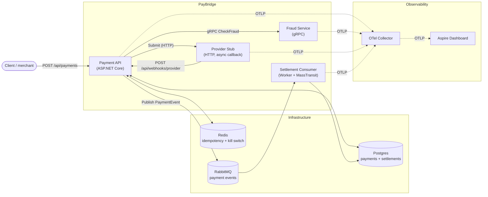

# PayBridge

A small payment-orchestration backend that takes a payment request, runs it through a
fraud check, submits it to a (stubbed) provider, asynchronously receives a webhook with
the final result, and emits a settlement event that a downstream consumer persists.

It is built as a vertical slice of a real production system — multi-service, asynchronous,
observable end-to-end, with realistic concerns wired in (idempotency, kill switch, PII
masking, tracing, metrics, structured logs, resilience policies, health checks, automated
tests). It is deliberately small enough to read in one sitting.

---

## TL;DR — run it

You need Docker Desktop with Compose v2 (`docker compose version` ≥ 2). Nothing else.

```powershell
docker compose up --build -d
```

First build is ~10 minutes (it builds 4 .NET images from scratch). After that:

| Surface             | URL                                  | Notes                              |
| ------------------- | ------------------------------------ | ---------------------------------- |
| Payment API         | http://localhost:8080                | Swagger at `/swagger`              |
| Provider stub       | http://localhost:8082                | Direct API, simulates the PSP      |
| RabbitMQ console    | http://localhost:15672                | login `paybridge` / `paybridge`    |
| Aspire Dashboard    | http://localhost:18888                | Traces / metrics / logs (no auth)  |
| Postgres            | `localhost:5432`                      | `paybridge` / `paybridge` / `paybridge` |

Smoke test:

```powershell
$body = '{"merchantId":"merch-acme","idempotencyKey":"demo-001","amount":42.50,"currency":"USD","customerEmail":"alice@example.com","method":"CreditCard"}'
curl.exe -X POST http://localhost:8080/api/payments `
  -H "Content-Type: application/json" -H "X-Tenant-Id: tenant-a" -d $body
```

Within a few seconds the payment goes `Created` → `Submitted` → `Completed` and a row
appears in the `settlements` table. The full trace is visible in the Aspire Dashboard.

Tear down:

```powershell
docker compose down -v
```

---

## Architecture



### Request flow

1. `POST /api/payments` arrives with an `X-Tenant-Id` header and a JSON body containing
   `merchantId`, `idempotencyKey`, `amount`, `currency`, `customerEmail`, `method`.
2. **Idempotency check** — `(merchantId, idempotencyKey)` is looked up in Redis. On a hit
   the cached response is returned immediately. Same tuple is also a unique DB index so a
   lost race still resolves cleanly.
3. **Kill switch** — Redis key `paybridge:kill:payments`. If set to `1`, the API returns
   `503 payments_disabled` without doing any work.
4. The payment is persisted as `Created`, then state-transitioned through
   `FraudChecking` → `Submitted` (or `Failed`).
5. **Fraud check** — gRPC to `FraudService`. If unavailable the payment is failed (not
   silently approved). If the score is too high or the rules match, the payment is failed
   with `fraud_rejected:<reason>`.
6. **Provider submit** — HTTP to `ProviderStub` which always *accepts* (`202`) and then
   asynchronously calls our webhook after a small random delay. Real providers behave
   this way.
7. **Webhook** — `POST /webhooks/provider` updates the payment to `Completed` /
   `Failed` and publishes a `PaymentEvent` to RabbitMQ. The webhook span carries
   `paybridge.originating_trace_id` so the async callback can be linked back to the
   original request trace.
8. **Settlement consumer** — subscribes to `PaymentEvent`s, writes a row in `settlements`
   (idempotent on `(PaymentId, FinalStatus)`).

### Service responsibilities

| Service                    | Purpose                                                 | Storage          |
| -------------------------- | ------------------------------------------------------- | ---------------- |
| `PayBridge.PaymentApi`     | Payment lifecycle, idempotency, webhook, event publish  | Postgres, Redis  |
| `PayBridge.FraudService`   | gRPC scoring service (deterministic rules + score)      | none             |
| `PayBridge.ProviderStub`   | Simulates a PSP — accepts then asynchronously webhooks  | in-memory        |
| `PayBridge.SettlementConsumer` | Persists final-status events for reconciliation     | Postgres         |
| `PayBridge.Shared`         | Domain types, telemetry config, PII masking             | n/a (library)    |
| `PayBridge.Contracts`      | gRPC `.proto` + generated client/server                 | n/a (library)    |

### Why these technologies

- **ASP.NET Core minimal APIs** — small enough to fit in one file per endpoint group.
- **MassTransit + RabbitMQ** — abstracts the broker, gives us a competing-consumers
  pattern out of the box, and is instrumented by OpenTelemetry without extra wiring.
- **Postgres + EF Core** — strong consistency on the payment record is non-negotiable.
- **Redis** — sub-millisecond idempotency lookups; also used as a feature flag.
- **gRPC** for fraud — internal service-to-service, latency-sensitive, schema-first.
- **OpenTelemetry → OTel Collector → Aspire Dashboard** — one wire format, one UI for
  traces / metrics / logs. The collector is the seam where you'd later swap in Tempo,
  Prometheus, Loki, or any commercial backend without touching service code.

---

## Project layout

```
src/
  PayBridge.Shared/         Domain entities, observability, security helpers
  PayBridge.Contracts/      gRPC .proto definitions
  PayBridge.FraudService/   gRPC fraud-scoring service
  PayBridge.ProviderStub/   Fake payment provider (async webhook)
  PayBridge.PaymentApi/     Main API — orchestrates the full lifecycle
  PayBridge.SettlementConsumer/  Worker that persists settlement records
tests/
  PayBridge.PaymentApi.Tests/    xUnit + WebApplicationFactory + in-memory fakes
deploy/
  otel-collector-config.yaml     OTel Collector pipelines
docker-compose.yml          Full local stack (8 services)
```

---

## Observability

Every service is instrumented identically through `PayBridge.Shared.Observability`:

- **Traces**: ASP.NET Core, HttpClient, gRPC, EF Core, Redis, MassTransit. Custom
  `PayBridge` `ActivitySource` for business spans (`payment.create`, `fraud.score`,
  `provider.submit`, `webhook.apply`, `settlement.persist`). Spans are tagged with
  `paybridge.merchant.id`, `paybridge.tenant.id`, `paybridge.payment.id` etc — never
  with raw PII.
- **Metrics** (`PayBridge` meter, see `Telemetry.Metrics`):
  - `paybridge.payments.created` / `.completed` / `.failed` — labelled by merchant,
    currency, method, reason bucket
  - `paybridge.payment.duration` — histogram, labelled by outcome
  - `paybridge.fraud.checks`, `paybridge.provider.calls`, `paybridge.provider.duration`
  - `paybridge.webhooks.received`, `paybridge.events.published` / `.consumed`
  - `paybridge.idempotency.hits`, `paybridge.killswitch.rejections`
  - Plus the standard ASP.NET, HttpClient and .NET runtime instruments.
- **Logs**: Serilog → JSON to stdout, enriched with `service.name`, machine, environment,
  and the current `trace_id` / `span_id` (`TraceContextEnricher`). The Collector ships
  these on the OTLP logs pipeline so they show up in the Aspire Dashboard alongside the
  trace they belong to.

The OTel Collector pipeline (see [deploy/otel-collector-config.yaml](deploy/otel-collector-config.yaml))
applies `memory_limiter`, `batch`, a `resource` processor (cluster/region tags),
an `attributes` processor that **deletes** `http.request.header.authorization` and
`cookie` as defence-in-depth, and exports OTLP gRPC to the Aspire Dashboard.

---

## Operational concerns

### SLOs

Three SLOs we measure and would alert on in production:

| #   | SLO                                                     | Window | Target  | Metric / measurement                                                | Alert when                                |
| --- | ------------------------------------------------------- | ------ | ------- | ------------------------------------------------------------------- | ----------------------------------------- |
| 1   | **Payment availability** — non-5xx responses on `POST /api/payments` | 28d    | 99.9 %  | `http.server.request.duration_count` filtered to that route        | Burn rate > 14.4× over 1h or > 6× over 6h |
| 2   | **Payment success rate** — non-fraud, non-provider-rejected | 28d    | 99.0 %  | `paybridge.payments.completed` / (`completed` + `failed{reason=internal\|provider_unavailable}`) | Drops below 98 % for 15 min               |
| 3   | **Settlement freshness** — webhook → settlement row in DB | 7d     | p99 < 5 s | Difference between `EventTimestamp` and `PersistedAt` in `settlements` | p99 > 10 s for 10 min (broker / consumer lag) |

Idempotency-cache hits, kill-switch rejections, and explicit fraud rejections are
intentionally not in (1) — they aren't faults of the service.

### Resilience

- **Outbound HTTP & gRPC** use `AddStandardResilienceHandler()` (retry + timeout +
  circuit breaker). All policies emit metrics so trips and retries are visible.
- **Idempotent retries** — every state-changing path is idempotent at the API
  (idempotency key + unique index), at the consumer (`(PaymentId, FinalStatus)` unique
  index), and on the webhook (re-applying a terminal status is a no-op).
- **Critical-dependency gating** — fraud failure does not silently approve; it fails
  the payment with `fraud_check_unavailable` so an operator notices.
- **Kill switch** — `paybridge:killswitch:payments` flips writes to `503` instantly
  without code change or deploy.

### Health checks

`GET /health/live` (liveness — process up), `GET /health/ready` (readiness — only the
`critical`-tagged dependencies, currently Postgres and RabbitMQ), and `GET /health`
(full status, including Redis as `degraded`-on-fail). Cache loss never takes the API
out of rotation; broker or DB loss does.

### Incident runbook — "payment success rate dropped below 95 %"

1. **Confirm in Aspire** — open the Aspire Dashboard, filter `paybridge.payments.failed`
   by `reason`. The label bucket immediately localizes the failure mode (fraud / provider
   / internal / kill-switch).
2. **If `reason=provider_unavailable`** — check `provider.calls{outcome=error}` on the
   Payment API, then pull traces. If the resilience handler shows the circuit open,
   the fix is on the provider side. Status page + escalate.
3. **If `reason=fraud_check_unavailable`** — fraud service is down or rate-limited.
   Check fraud-service health and traces; restart pod / scale up. Do not approve
   payments behind the broken check.
4. **If failures are spread across reasons** — most likely a release. Check recent
   deploys, roll back. Consider flipping the kill switch (`SET paybridge:kill:payments 1`)
   to drain in-flight requests while debugging.
5. **If broker lag is suspected (settlement freshness SLO breach)** — check RabbitMQ
   queue depth at http://localhost:15672 (or production console) and the
   `paybridge.events.consumed` rate from the settlement consumer. Scale consumers
   horizontally; messages are queue-load-balanced.
6. **Always**: capture one or two affected `payment.id`s and link the relevant traces
   in the incident channel before mitigation; this is how the postmortem gets written.

### PII & data governance

- Customer email is **never logged in clear** — `PiiMasking.MaskEmail` produces
  `a***e@example.com`. It is also never tagged on a span.
- Spans carry IDs (`paybridge.payment.id`, `paybridge.merchant.id`, `paybridge.tenant.id`)
  and amounts only — no PAN, no customer name, no email.
- `paybridge.payments` stores `customer_email` because regulators require us to be able
  to answer "did this person pay us?" — but it is not exposed by any API today, and
  would be encrypted at rest in production (column-level + KMS).
- The OTel Collector strips `Authorization` and `Cookie` headers from every signal as a
  defence-in-depth — even if a future contributor accidentally captures them.
- Tenant isolation is enforced at the application layer (`X-Tenant-Id` header tagged
  on every payment row and every span). For a real deployment we'd add row-level
  security in Postgres so a leak in the API still can't cross-read tenants.

### Cost awareness at 1 000 payments/min

That works out to ~1.4 M payments/day; at the cardinality limits below the system
emits roughly 200–300 GB/month of telemetry, which is the dominant cost lever.

- **Trace sampling**: parent-based, 100 % for now (low traffic). At scale switch the
  OTel Collector to `tail_sampling` keeping (a) all errors, (b) all spans for traces
  slower than p95, (c) 5 % of healthy payments. The change is in the Collector, not in
  services.
- **Metric cardinality**: every custom counter caps labels at
  `(merchant_id, currency, method, reason_bucket)`. `reason` is bucketed
  (`fraud_rejected`, `provider_unavailable`, etc.) — never raw provider message.
  Merchant cardinality is the cap; ~5 000 active merchants is fine, beyond that we'd
  drop the label on payment-level histograms and keep it only on counters.
- **Log retention**: hot 7 days, warm 30 days, glacier 1 year (PCI-relevant fields
  longer per scope).
- **DB growth**: ~50 GB/month of payment rows + settlements at 1 000/min. Partition
  `payments` and `settlements` by `created_at` monthly; archive partitions older than
  6 months to cold storage.

---

## Tests

```powershell
dotnet test
```

17 xUnit cases covering the behaviour we actually care about:

**`PaymentServiceTests`** (NSubstitute fakes, in-memory EF):

- Happy path: fraud approves + provider accepts → payment ends `Submitted`, event published
- Fraud rejects → `Failed` with `fraud_rejected:<reason>`, provider is **not** called
- Idempotency cache hit → returns the original response, fraud/provider **not** called
- Kill switch active → throws `PaymentRejectedException` immediately, never touches downstream
- Webhook applies completion → `Completed` + `CompletedAt` set + event published
- Duplicate webhook callback on an already-terminal payment is a no-op

**`PiiMaskingTests`** (data-driven theories): masking rules for normal emails, edge
cases (`null`, empty, no `@`, single-char local), and the amount-bucket helper used to
keep metric label cardinality bounded.

The full ASP.NET pipeline (resilience handlers, real gRPC client, real RabbitMQ) is
exercised by `docker compose up` + the curl smoke tests at the top of this doc — that's
where integration-level confidence comes from.

---

## What is intentionally out of scope

- **EF Core migrations.** `EnsureCreatedAsync` is used on Payment API boot to create
  both `payments` and `settlements`. For a real deployment we'd replace this with
  versioned migrations applied by a dedicated job.
- **Authn/Authz.** No JWT, no signed webhook (would be HMAC over body + replay
  protection in production). The `X-Tenant-Id` header is trusted; in production it
  would come from the verified token.
- **Real provider integrations.** `ProviderStub` is the only PSP. Adding a real one is
  a new `IProviderClient` implementation.
- **Multi-region.** The compose file is one region. The contracts (idempotency,
  events) are designed to survive a regional cut-over, but the deployment manifests
  aren't here.

---

## A note on AI tools

I used GitHub Copilot for boilerplate (EF / MassTransit / OTel wiring, Dockerfiles,
test scaffolds) and as a sounding board for the README structure. The architecture,
the failure-handling design, the SLOs, and every non-trivial debugging decision were
mine.

---

## Quick reference — useful commands

```powershell
# Logs from a single service
docker compose logs -f payment-api

# Inspect tables
docker compose exec postgres psql -U paybridge -d paybridge -c '\dt'
docker compose exec postgres psql -U paybridge -d paybridge -c 'SELECT "Id","Status" FROM payments ORDER BY "CreatedAt" DESC LIMIT 5;'

# Flip the kill switch on / off
docker compose exec redis redis-cli SET paybridge:kill:payments 1
docker compose exec redis redis-cli DEL paybridge:kill:payments

# Rebuild a single service after a code change
docker compose up -d --build payment-api

# Fresh start (wipes the DB volume)
docker compose down -v && docker compose up --build -d
```
